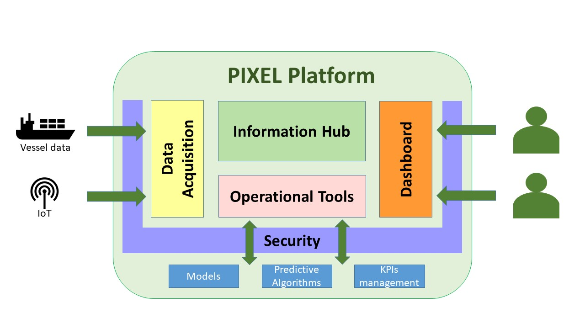

# PIXEL - Where IoT meets the Port of The Future

PIXEL is the first smart, flexible and scalable solution for reducing environmental impacts while enabling the optimization of operations in port ecosystems through IoT.

PIXEL enables a two-way collaboration of ports, multimodal transport agents and cities for optimal use of internal and external resources, sustainable economic growth and environmental impact mitigation, towards the Ports of the Future. Built on top of the state-of-the art interoperability technologies, PIXEL centralises data from the different information silos where internal and external stakeholders store their operational information. PIXEL leverages an IoT based communication infrastructure to voluntarily exchange data among ports and stakeholders to achieve an efficient use of resources in ports.

[More info available on our web site](https://pixel-ports.eu/)

This repository contains all the available resources about the PIXEL Platform conponents, deployements and documentation.

Documentation for PIXEL is available here [https://pixel-ports.readthedocs.io/en/latest/](https://pixel-ports.readthedocs.io/en/latest/)

* Documentation : The code to generate the readthedocs web site
* Installation : The installation resources to deploy a PIXEL Platform following our guideline

And the opensources components for each layer:

* DataAcquisitionLayer
* InformationHub
* OperationnalTools
* Dashboard
